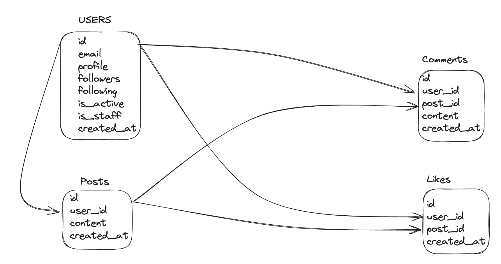

## Backend APIs

### User APIs

1. User Registration

POST api/users/register/

{
  "email": "user@example.com",
  "password": "securepassword123",
  "profile": "Optional profile text"
}

2. Token Generation (Login)

POST /api/token/

{
    "username": "testuser",
    "password": "password123"
}

3. Token Refresh

POST /api/token/refresh/

{
    "refresh": "eyJhbGciOiJIUzI1NiIsInR5cCI6IkpXVCJ9..."
}

4. User Profile

GET /api/users/profile/

Headers:

Authorization: Bearer <access_token>

--- 

### Post APIs

1. Create a Post

POST /api/posts/

2. Fetch All Posts

GET /api/posts/

3. Fetch a Single Post

GET /api/posts/<post_id>/

4. Update a Post

PUT /api/posts/<post_id>/

5. Delete a Post

DELETE /api/posts/<post_id>/

---

### Comment APIs

1. Create a Comment

POST /api/posts/<post_id>/comments/

2. Fetch Comments of a Post

GET /api/posts/<post_id>/comments/

---

### Like APIs

1. Like a Post

POST /api/posts/<post_id>/like/

2. Unlike a Post

DELETE /api/posts/<post_id>/like/

3. Get Likes Count for a Post

GET /api/posts/<post_id>/like/

---

